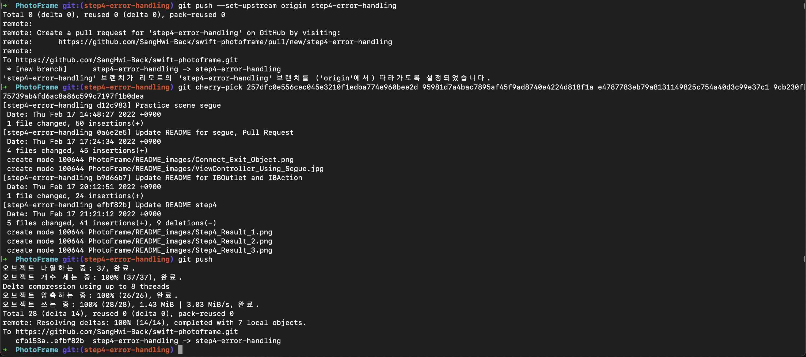

# swift-photoframe

## Step1 : 프로젝트 생성하기

- [x] TabBar Controller를 추가하고 Initial ViewController로 지정한다.
- [x] TabBarController에 Tab을 2개로 지정하고, Scene을 각각 연결한다.
- [x] 두 개 Scene 중에 첫 번째 Scene에 Custom Class를 ViewController로 지정한다.
- [x] 자동 생성된 ViewController 클래스 `viewDidLoad()` 함수에서 `print(#file, #line, #function, #column)` 코드를 추가하고 실행하면 콘솔 영역에 무엇이 출력되는지 확인한다.

### 실습 과정
   

기본 스토리보드로 주어지는 Main.storyboard 에서는 UIKit에 정의된 UIViewController가 위치하여 있고, 이 ViewController의 속성 중 `isInitialViewController`가 체크되어 있다.      
이는 왼쪽에 우향 화살표를 통해 알 수 있다.   

   
보시다시피 `isInitialViewController`의 체크를 해제하면 왼쪽 화살표가 없어진다. initialViewController가 없어진 프로젝트를 실행하면 오류가 발생한다.

과제 수행을 위해 모든 요소들을 다 제거한다. `Command`+`A`로 모두 선택하거나 드래그 앤 드롭으로 모두 선택 후 `Backspace`를 이용하여 요소들을 전부 제거한다.   
   
여기서, `Command`+`Shift`+`L` 혹은 우측 상단의 `+` 버튼을 이용하여 라이브러리 창을 호출한다.   
   
UITabBarController 추가를 위해 TabBar 등을 입력한다. 개인적으로는 클래스 이름 그대로 적는 것을 선호한다. 이 편이 좀 더 정확한 결과를 유도하는 것 같아 선호한다.   
엔터 키를 누르거나 선택된 리스트를 그대로 드래그 앤 드롭으로 스토리보드 화면에 드롭한다.   
   
`isInitialViewController`가 없으므로, 맨 처음 TabBarController의 `Attribute Inspector`창을 확인한다.   
   
실습을 위해 미리 주어진 두 개의 뷰컨트롤러를 모두 삭제한다. 하지만, TabBarController는 남았으므로 UIViewController를 스토리보드에 추가한 뒤 새로 연결하도록 한다.   
   
아까 UITabBarController때처럼 Library를 열어 UIViewController를 검색한다. 같은 방법으로 두 개의 UIViewController를 추가한다.   
   
UITabBarController의 맨 위 검은 바 부분의 첫번째 버튼에서 `Control`+Drag 를 이용하여 두 개의 UIViewController를 연결한다. UITabBarController의 하위 관계이므로, `view controllers`를 선택해준다.   

   
   
이제 첫번째 뷰컨트롤러를 위한 CustomClass를 생성한다. `Commans`+`n`을 입력하여 iOS 플랫폼의 `Cocoa Touch Class`를 찾아 Next를 클릭하거나 Enter를 입력한다.      
자동완성을 이용해본다. Class 이름은 'FirstSceneViewController'로 할 예정이다. 우선 클래스 이름을 입력하는 부분에 'FirstScene'을 입력한 후 아래 `Subclass of:` 부분에 UIViewController를 입력한다(자동완성을 지원한다).      
UIViewController가 입력되는 순간 'FirstScene' 뒤에 'ViewController'가 따라 붙는다. Next를 클릭하거나 Enter를 누르고 프로젝트 폴더 안에 클래스 코드를 담을 swift파일을 저장한다.
   
FirstSceneViewController가 바로 보이게 되었다. 주어진 코드를 입력한다.   
   
다시 스토리보드로 돌아가서 `Identity Inspector` 화면의 Custom Class 부분이 비어있다. FirstSceneViewController를 자동완성으로 입력하거나, 수동으로 입력한 후 아래의 모듈을 PhotoFrame으로 맞춘다.   
다른 뷰 컨트롤러로 갔다가 다시 돌아와 적용이 잘 되었는지 다시 확인한 후 실행해본다.   
   
원하는 결과를 얻을 수 있었다.

### GitHub Push Error Alert!

GitHub `Push` 시 다음의 오류가 발생하였다.

* Remote Repository에 `PR`을 보냄
* `Merge`가 된 이후에 `Rebase`를 진행

이후에 다시 GitHub Push를 하려고 하는데 다음의 오류가 발생한다. Git Stash를 이용해서 지금까지의 내용을 넣어놓은 뒤 Pull을 받을 필요가 있을 것 같다.


원인은 간단했다. 프로젝트의 일부 파일이 제대로 커밋되지 않은 상태에서 Merge된 이후 다시 Push 하려고 하면서 깃 자체가 꼬여버렸다.   
`충돌을 해결`하고 fork한 나의 저장소에서 `Pull`을 받은 뒤 `Stash Apply`하면, 지금까지 한 내용을 버리지 않고 `커밋`하면 된다.


---

### UIKit View Management 클래스 중 UITabBarController / UITabBar

UIKit에 포함된 View Controllers를 관리하는 UIKit View Management 클래스들은 하위 뷰 컨트롤러들을 이용하고 이동하는 인터페이스를 제공한다.

#### UITabBarController

**Container View Controller의 일종으로, 선택 가능한 다수의 인터페이스를 관리하는 뷰 컨트롤러 클래스입니다. 여기서 '선택'이란 어떤 하위 뷰 컨트롤러를 보여줄지 결정하는 것입니다.**

다른 뷰 컨트롤러 클래스와는 다르게 서브클래싱을 꼭 하지 않는 경우도 많은 클래스이다. 간단히 말해 탭에 따라 완전 다른 정보들 혹은 같은 정보의 다른 인터페이스들을 보여주는 것인데, 이것은 뷰를 보여주는 root viewcontroller를 바꾸는 것이다.

위에 설명한 부분은 강조할 필요가 있겠다.


1. Tab1을 탭한 상태로 앱이 실행되었다. Tab1에는 Tab1's root ViewController가 있으므로, ViewController가 제공하는 화면이 화면에 출력된다.   
   몇 가지 화면을 들어가면서 여러 View들이 쌓이게 되었다. 이제 Tab2를 탭 해본다.
2. Tab2에는 Tab2's root ViewController가 있다. Tab을 바꿈으로써 root ViewController가 바뀌고, 새로운 root ViewController가 제공하는 화면이 출력된다.   
   몇 가지 화면을 더 들어가본다.
3. Tab1으로 돌아온다. 이전의 Tab1's root ViewController로 root ViewController가 바뀐다. root ViewController에 의해 보이던 화면들이(Tab1's root ViewController에 의해 제공되던 화면, Child View Controller도 hierarchy 그대로) 보이게 된다.

관련 클래스로는 Tab 자체를 표현하는 UITabBarItem 클래스가 있다.

#### UITabBar

**특정 탭 바 안의 모든 버튼들은 표시하고, 버튼 선택에 따라 하위작업, 뷰, 앱 모드들을 선택할 수 있도록 한다.**

주로 UITabBarController의 하위 요소로서 사용되지만, 단독적으로 사용되기도 하다. UITabBar는 UITabBarItem이 선택될 경우 delegate 객체에 정보를 알리게 되고, 이 객체를 개발자 맘대로 다룰 수 있게 된다.

참고로 UITollbar는 전혀 다른 클래스이다. UITabBar는 UITabBarItem이 앱의 모드를 바꾸기 위해 사용하는 뷰라면, UIToolBar는 사용자가 현재 화면(컨텐츠)에서 할 수 있는 액션들을 모아놓는 곳이다.

UITabBar를 따로 생성하는 방법은 Interface Builder 를 이용하거나, Programmatically하게 만드는 방법이 있다. 구현이 완료되면 UITabBarDelegate 프로토콜을 구현한 클래스에서 UITabBar가 전달하는 report(각 탭을 탭할 경우 발생)를 받거나 부수적인 처리를 손쉽게 할 수 있도록 도와준다.   
자세한 사항은 다음의 문서를 참고한다 ([UITabBar Apple Documentation](https://developer.apple.com/documentation/uikit/uitabbar))

---

## Step2 : IBOutlet 실습

- [x] Xcode 프로젝트 내비게이터에서 Main.storyboard 파일을 선택하고 First Scene 에 있는 'First View' 레이블(Label)을 선택하고 Assistant Editor 모드로 변경한다.
- [x] 레이블을 선택하고 Control + 드래그해서 ViewController 코드에 IBOutlet으로 연결한다.
- [x] UILabel의 속성을 이용하여 여러 작업을 수행한다.
- [x] UILabel에서 Lucas에 언급되지 않은 속성들에 대해서도 공식문서를 찾아본다.

### 결과 화면


### 학습한 내용에 대한 간단한 정리

* Interface Builder 의 `Control`+Drag 를 통해 원하는 요소를 다른 요소와 관계시키거나, 커스텀 클래스에 참조시킬 수 있다.
* 컨트롤 드래그 를 이용하여 요소끼리 관계를 맺을 경우 각 요소의 위치 제약조건을 설정하게 된다.
* 커스텀 클래스에서 참조할 경우 변수명 앞에 `@IBOutlet`이 붙게 되고 `weak`도 추가 되어 있다.
* 특히 weak에 대한 부분은 `Reference Count와` `View Life Cycle`에 연관된 문제로 간단히 살펴볼 필요가 있음(깊이 들어가게 되면 이번 주 스텝 학습에 지장이 될 것으로 예상).

---

### GitHub Push Error Alert AGAIN!

PR이 git merge가 되었다는 소식을 듣고는 main branch로 이동 후 fetch 다음 rebase 하더니 계속 Conflict가 발생하였다.   

   
커밋을 되돌리는 git restore 명령어를 이용하여 충돌을 계속 해결하며 rebase를 실행시켜 나갔지만 이후에 많은 파일에서 이런 종류의 내용들이 추가되기 시작했다.

```
<<<<<<<< HEAD

=============
```

프로젝트 파일을 여니 이런 오류도 발생하였다.

```
The project ‘project’ is damaged and cannot be opened due to a parse error. Examine the project file for invalid edits... control conflicts
```

구글링을 해보니 `xcodeproj` 파일 안에 `pbxproj` 파일을 열어보면 위의 'HEAD' 같은 중복되는 내용들이 발견되면 수정해주라는 내용이었다.   

**문제가 되는 파일을 미리 복사해두고 불필요한 부분을 지우니 프로젝트 파일을 열 수 있었다.**

---

### UILabel Complement Study

현업에 들어가게 될 경우 가장 많이 사용하게 될 UILabel에서 특이한 뷰를 만들 때 사용할 두 개의 주제에 대해 실습 없이 내용만을 업데이트 해 보도록 한다.

### Attributed Strings

NSAttributedString 객체를 attributedText 에 반영하는 식으로 적용하도록 한다. attributedText, text 프로퍼티 상관없이 최종적인 내용은 가장 최신 반영내용을 그대로 보여주게 된다.

UILabel의 attributedText 프로퍼티는 각 문자(혹은 다수의 문자)의 형태를 결정하기 위한 프로퍼티이다. NSAttributedString API를 사용하여 적용을 하게 되며, 문자열의 font/color/alignment를 설정하게 된다.   
attributedText에 설정값만 바꾸게 되면 라벨은 설정값을 오버라이드하여 적당한 설정으로 바꾸게 된다. 예를 들어 color를 변경하였을 때 모든 글자의 색은 바뀌지만, 굵은 글씨 형태나 이탤릭체 형태 등은 바뀌지 않는 것이다.

만약 UILabel 컨텐츠의 형태가 일정하다면 NSString 객체를 text 프로퍼티에 적용하는 것도 좋다. NSString에는 font/color/alignment/lineBreakMode 프로퍼티 등이 설정되어 있다.

Interface Builder에서 많이 사용하게 될 속성은 글자 크기에 관한 부분이다. adjustsFontSizeToFitWidth, minimumScaleFactor 등 각 속성에 대한 부분은 다음 기회에 추가로 설명할 수 있도록 하겠다.

### textRect(forBounds:limitedToNumberOfLines:)

이 메소드는 라벨의 컨텐츠가 나타날 영역을 표시할 때 사용하는 메소드이다. textRect(forBounds:limitedToNumberOfLines:)를 오버라이드하면 numberOfLines를 보고 컨텐츠가 보일 양을 조절할 수 있는 등 유용하게 사용할 수 있다.

호출을 위해서는 sizeToFit()/sizeThatFits() 가 선행 호출되어야 함을 주의한다. 

---

## Step3 : IBAction 실습

- [x] Main.storyboard 파일에서 UIButton을 생성하고 커스텀 클래스에 IBAction으로 연결한다.
- [x] UIButton의 Title을 수정하고 어떤 Attribute가 있는지 확인하였다.
- [x] IBAction과 IBOutlet에 대한 고찰을 해본다.

### 결과 화면

   

### 이후 학습할 내용 및 소감 등

* git fetch -> git rebase 중 계속 오류가 발생하고 있다. git을 계속 사용하면서 부족하다고 생각이 되는 부분을 정리하면서 새로운 부분을 배워가고 있는 중이다.   
branch는 commit의 포인터 역할을 한다는 것이나, fetch 후 git diff를 이용하여 실제 어떤 일이 발생하고 있으며, Git에서 설명하는 HEAD, index 등의 의미도 정확히 파악하려 노력중이다.
* IBAction, IBOutlet에 대해 공부하면서 Annotation에 대한 정리도 가능할 것이라도 기대되고 있다.   
또한, 왜 IBOutlet은 weak로 만들어지는지도 알아보면 예전에 정리한 ARC와 비교하여 더 많은 공부가 될 것으로 기대하고 있다.

---

# Git for CodeSquad

코드스쿼드에서 깃을 사용하면서 계속 오류가 발생하고 있다. 이대로는 안된다..... 한번 제대로 정리하지 않으면 끝나지 않는 오류의 늪으로 갈 것 같다.....

## 명령어 정리
1. clone (git clone url)

기존의 레포지토리 혹은 대상으로 정한 레포지토리의 복제본을 만듭니다.   
해당 명령어는 Git URL 이 지원하는 프로토콜을 따라야 합니다.
* 로컬 또는 원격 레포지토리 복제
* 최초(bare) 레포지토리 복제
* 단순(shallow) 복제 옵션을 사용하여 레포지토리 부분을 복제

<예시>
```
/* repo 주소(<repo>)에 있는 레포지토리를 특정 디렉토리(<directory>)로 복사 합니다. */
git clone <repo> <directory>
// 특정 디렉토리로 복사 레포지토리를 위치시킴
git clone https://........ /Users/Beck/Desktop/workSpace/MyProject
/* repo 주소(<repo>)에서 레포지토리를 복제한 뒤, 태그(<tag>)만 복제합니다. */
git clone --branch <tag> <repo>
// Head ref 다운로드 하지 않고 특정 브랜치만 복제.
git clone -branch feature_new https://........
```

2. checkout (+옵션 b 알아보기)   
Git에서 “체크아웃”이란 대상 엔터티의 다른 버전 간 전환을 의미합니다. 여기서의 엔티티는 파일, 커밋, 브랜치 세 가지입니다. 주로 브랜치 간의 전환을 할 경우 많이 사용하고, 커밋을 취소할 때도 종종 사용합니다.   
변경이 일어날 경우 프로젝트 기록(로컬 프로젝트 파일 및 폴더)에 변경 사항이 저장되기 때문에 읽기 전용 작업은 아닙니다. 그러므로, 브랜치 체크아웃 시에 저장된 버전 일치를 위하여 새 커밋을 모두 기록(Commit) 하도록 지시합니다.   
git checkout은 git branch와 밀접하게 작동합니다.

```
// 브랜치 중 develop 브랜치로 이동
$> (main) git branch
main
develop
$> (main)git checkout develop
$> (develop)

// 브랜치를 만드는 방법 1
$> (develop) git branch feature_new
$> (develop) git checkout feature_new
$> (feature_new)

// 브랜치를 만드는 방법 2
$> (develop) git checkout -b feature_new
$> (feature_new)

---

// 원격 브랜치에서 Git 체크아웃(fetch로 우선 컨텐츠를 모두 불러와야 함)
$> (main) git fetch --all
// 최신 Git 원격 브랜치 정보를 이용하여 체크아웃
$> (main) git checkout https://...../User/main/feature_new
// 이전 Git 원격 브랜치 정보를 이용하여 체크아웃
$> (main) git checkout -b feature_new main/feature_new
```

**detached HEAD**

_HEAD란 Git의 현재 스냅샷을 얘기합니다._ git checkout은 내부적으로 브랜치 혹은 커밋을 가리키도록 HEAD를 업데이트 하는 것입니다. 브랜치가 아닌 커밋을 체크아웃하면 detached HEAD 상태가 됩니다.   
detached HEAD는 경고입니다. 앞으로 수행할 모든 작업이 프로젝트 개발의 나머지 부분과 분리되어 있음을 뜻합니다. 이 상태에서 개발을 진행해버리면 돌아갈 수 있는 브랜치가 없습니다.   
개발은 항상 브랜치에서 이뤄져야 한다는 중요한 점을 다시 한번 강조합니다. 분리된 커밋에서 새 커밋이 발생하면 이전 커밋과의 관계가 애매해집니다.

3. branch (+옵션 d 알아보기)   
브랜치 만드는 명령어다. 간단히만 보고 넘어가자. 브랜치는 커밋의 포인터일 뿐이다.

```
// 모든 브랜치 리스트를 보여준다.
git branch
// 원격 브랜치까지 모두 보여준다.
git branch -a
// 현재 브랜치(체크아웃 된)에서 특정 브랜치를 생성한다.
git branch feature_new
// 특정 브랜치를 삭제한다(safe).
git branch -d feature_new
// 특정 브랜치를 삭제한다(unsafe, unmerged commit 무시. 커밋 날려버릴 
때 좋음).
git branch -D feature_new
// 현재 브랜치(체크아웃 된)의 이름 변경
git branch -m feature_renamed
```

4. status   
현재 상태를 보여준다. 현재 상태라 함은 인덱스 커밋과 HEAD 커밋의 차이점을 경로 형태로 보여주는 것이다.
5. commit
6. rm   
단순히 지운다는 의미보다는, 다음 커밋을 의미하는 Git Index가 추적하고 있는 파일들을 삭제하는 것이다. 이는 Staging Area에 있는 파일이라고 해도 되겠다. 물론, Staging Area/Working Directory 둘 다 삭제하는 명령어도 가능하지만, 아쉽게도 Working Directory에서 삭제하는 방법은 존재하지 않는다. 또한, 브랜치도 삭제 불가하다.   
주의할 점은 현재 HEAD의 파일과 Staging Index의 파일 버전이 일치해야 한다는 것이다. 만약 일치하지 않으면 Git에 의해 명령어가 차단된다.   
git repository에서 staging area/working directory 모두 파일 삭제를 하고 싶은 경우는 Shell에서 rm 명령어와 git add를 같이 쓴다.
```
git rm file1
git rm file1 file2 file3
// -f force 옵션은 Git 자체에서 수행하는 HEAD 와의 버전 검사를 무시한다.
git rm -f file1
// 미리 시뮬레이션 해보고 결과를 볼 수 있는 -n 혹은 --dry-run 옵션.
git rm -n file1
git rm --dry-run file1
// cached 옵션을 이용해서 Staging-Index만을 지우도록 할 수 있다.
git rm --cached file1
// -q는 결과를 숨긴다.
git rm -q file1

// git rm을 취소하는 방법은 reset, checkout 두 개의 방법이 있다.
git reset HEAD
git checkout .
```
7. add
8. push
9. pull request

특정 저장소에 대해 Contributor 로 등록된 유저가 보내는 Merge 요청이다. 저장소를 Fork를 받아 자신의 계정에 저장소가 만들어지게 되면 Contributor로 선정되는데, 이 상태에서 로컬 저장소로 소스를 가져와서 소스를 수정한 뒤 Push하면 Pull Request(PR)을 Fork 받아온 저장소로 요청할 수 있다. 해당 저장소의 Maintainer는 PR을 검토한 후 Reject 혹은 Merge할 수 있다.

Merge는 커밋들만을 합치는 것이기 때문에, 작업 브랜치 등은 사라진다. 브랜치 자체는 커밋이 아니고 커밋을 바라보는 포인터이기 때문이다. 계속 작업을 하고 싶다면, Merge한 이후 다시 main 브랜치로 돌아간 후 `git fetch -all upstream`을 이용해 최신의 변경사항을 로컬 저장소에 업데이트한 후 `git rebase upstream/[target branch]`를 이용하여 원본 저장소의 커밋 사항을 로컬 저장소로 가져온다. 이후에 `git push`해주면 최신 상태로 작업을 추가할 수 있다.  

10. remote add
11. fetch ([번역 : Git fetch와 pull, pull은 이제 그만!](https://merrily-code.tistory.com/124))
12. rebase([4. git merge와 git rebase의 차이](https://hajoung56.tistory.com/5))   
adsf
13. merge([4. git merge와 git rebase의 차이](https://hajoung56.tistory.com/5))   
asdf
14. git reset과 git revert ([Git reset과 revert 알고 사용하기](https://velog.io/@njs04210/Git-reset%EA%B3%BC-revert-%EC%95%8C%EA%B3%A0-%EC%82%AC%EC%9A%A9%ED%95%98%EA%B8%B0))   
HEAD 브랜치 이동. 정확히는 브랜치가 가리키는 커밋을 바꾼다. -> 바뀐 커밋 이후의 커밋은 지운다.   
현재 HEAD에서 revert 하면 현재 커밋의 이전 커밋을 뜻하는 새로운 커밋을 만든다. -> 이전 커밋을 뜻하는 새로운 커밋에서 또 revert를 하면 이전의 이전 커밋을 뜻하는 커밋을 또 만든다.

---

## Segue 에 대하여 

( [View Controller Programming Guide for iOS. Using Segues](https://developer.apple.com/library/archive/featuredarticles/ViewControllerPGforiPhoneOS/UsingSegues.html) )

segue를 이용하면 앱 인터페이스의 흐름을 정의할 수 있다. 두 개의 뷰 컨트롤러를 전환하는 것을 정의하는 것이다. 세그웨이의 시작점은 버튼, 테이블 한 줄, 제스쳐 등이 있다. 세그웨이의 도착점은 의도한 뷰 컨트롤러이다. 세그웨이는 언제나 새로운 뷰 컨트롤러를 보여줘야 하지만, 그 뷰 컨트롤러를 뒤로 돌릴 수 있는 unwind segue를 사용할 수 있다.

런타임 내에서 세그웨이를 불러오고 세그웨이에 의해 뷰컨트롤러들을 연결하는 것은 UIKit이다. 세그웨이 전에는 애플리케이션에 UIKit에 의해 알림이 전달된 뒤 실행되기 때문에 이를 이용해서 데이터를 주고받거나, 세그웨이를 차단할 수도 있다.

세그웨이는 굳이 프로그래밍으로 구현하지 않아도 된다. 같은 스토리보드 파일에서 `Control`+`Drag`를 이용해 적당한 요소를 시작 뷰 컨트롤러에서 목표 뷰 컨트롤러로 드래그하기만 하면 된다. 한 개의 요소가 세그웨이를 일으키더라도, 요소 내 다른 요소가 별개의 세그웨이 기능을 구현하는 것 또한 가능하다.

적당한 세그웨이 타입을 선택하는 것은 중요하지만, OS 버전 등에 따라 달라질 가능성이 있기 때문에 항상 조심해야 한다.

|      Segue type       | Behavior                                                                                                                                                                                              |
|:---------------------:|:------------------------------------------------------------------------------------------------------------------------------------------------------------------------------------------------------|
|      Show (Push)      | 새로운 컨텐츠를 show(\_:sender:) 메소드로 보여주는 방법이다. 대부분의 상황에서 원본 뷰 컨트롤러에서 모달 방식으로 실행된다. 주로 해당 메소드는 오버라이드 되는 형태로 사용된다. 예를 들어 UINavigationViewController 는 자체 스택에 뷰 컨트롤러들을 저장하게 된다.                               |
| Show Detail (Replace) | 새로운 컨텐츠를 showDetailViewController(\_:sender:) 메소드로 보여주는 방법이다. UISplitViewController 객체의 Detail ViewController 내용만을 바꾼다. 다른 뷰 컨트롤러에서 실행되면 Show(Push)와 같다.   UISplitViewController에서 작동하지 않으면 오류가 발생한다. |
|    Present Modally    | 모달로 뷰 컨트롤러를 전환할 때 여러 타입을 지정할 수 있다.                                                                                                                                                                    |
| Present as Popover    | 수평 상태에서 popover하게 세그웨이 한다.                                                                                                                                                                            |


**unwind segue를 만드는 법**   
1. 아래와 같이 프로그래밍을 통한 방법이 있다.
```
@IBAction func myUnwindAction(unwindSegue: UIStoryboardSegue) // Swift
- (IBAction)myUnwindAction:(UIStoryboardSegue*)unwindSegue // Objective-C
```
2. `Control`+Drag를 통해 특정 요소와 `Exit object` 를 연결한다.   
   

---

## IBOutlet 과 IBAction

[@IBOutlet, @IBAction에 대한 참고 블로그](https://velog.io/@myeongs07/iOS-IBOutlet-IBAction)   
Interface Builder (storyboard) 에서 UIButton, UILabel 등의 요소를 생성한 뒤 커스텀 클래스 내의 프로퍼티로 정의하고 싶을 경우 `Control`+Drag를 이용하여 프로퍼티를 생성하는데 그렇게 생성된 변수는 다음과 같은 형태로 클래스 내에 자동 선언된다.

```
@IBOutlet weak var titleLabel: UILabel!
@IBAction func buttonTouchUpInside(_ sender: UIButton) { }
```

IBOutlet, IBAction 의 정확한 작동 방식과 @의 의미등을 알아보고 싶었지만, Objective-C 시절의 자료밖에 없고 이 자료도 그렇게 신뢰가 가지는 않아서 간단히만 정리하고 넘어가도록 한다.

### IBOutlet

@IBOutlet 의 뜻은 Interface Builder에서 생성된 객체를 커스텀 클래스에서 참조하기 위해 사용하는 키워드이다. 이 때 Strong 혹은 Weak 를 선택하게 되는데, 일반적으로는 Strong이 기본값이 된다.

strong 혹은 weak로 선언되는 해당 변수는 코드가 아닌 인터페이스 빌더에 의해 선언되고 값이 반영되는 함수이므로, 스토리보드의 각 뷰 컨트롤러에는 하나의 뷰 컨트롤러 객체만을 커스텀 클래스로 선언해야 할 것이다. 

### IBAction

@IBAction도 @IBOutlet과 마찬가지로 인터페이스 빌더에서 정의된 것이다. 버튼 누르기, 피커 선택 등 특정 이벤트가 발생하면 그 응답을 받기 위해 사용한다.

---

## Step4 : Segue 실습

- [x] Scene을 추가하고 ViewController를 드래그해서 연결한다.
- [x] Segue의 여러 종류에 대해 확인해본다.

### 결과 화면


### Step4 이후 소감 한마디

Git에 대한 학습이 계속 이루어져야 할 것이다.   
rebase 시 무언가 문제가 생겨서 변경사항을 버리거나 할 때 다시 살펴보고 진행할 수 있도록 ```git base --abort```를 Sourcetree 의 오류 로그를 통해 알 수 있게 뙤었다.   
GUI툴을 조금 더 사용해보면서 CLI 환경과 얼마나 속도 차이가 있는지, 효율적인지 체험해 볼 예정이다.

요즘 코딩 테스트 문제풀이에 좀 소홀했는데 풀어보는 루틴을 생각해봐야겠다.

___

## Step5 ViewController Connect

- [x] 새로운 ViewController 클래스를 추가한 뒤 스토리보드(인터페이스 빌더)의 ViewController 커스텀 클래스로 등록해본다.
- [x] 닫기 버튼을 추가하고 ```self.dismiss(animated: Bool?, completion: (()->Void)?)```을 이용하여 이전 화면으로 돌아가는 기능을 구현.
- [x] 화면 관련 콜백 함수 사용
- [x] View Controller LifeCycle에 대해 공부해본다.
- [x] Modal Presentation Style에 대해 공부해본다.
- [x] Transition Style에 대해 공부해본다. 

### 이번 스텝의 목표

<p style="text-align: center">
   이 이미지를 최대한 이해해보는 것이다!<br/>
</p>

---

## UIViewController

* UIViewController는 뷰 계층(UIViewController.view에서 시작)을 관리하는 역할을 한다. 뷰, 뷰의 데이터, 뷰의 리소스, 화면 사이즈/회전 등에 대응한다. 공식문서에서 정의하는 뷰 컨트롤러의 역할은 다음과 같다.
  * 뷰들의 컨텐츠를 업데이트한다.
  * 뷰들의 상호작용에 반응한다.
  * 뷰의 크기를 바꾸고 전체적인 인터페이스의 레이아웃을 관리한다.
  * 다른 객체들(다른 뷰 컨트롤러도 포함)과의 협업을 관리한다.
* 흔히 UIViewController에서 MVC 패턴의 C 역할을 한다. 뷰 컨트롤러는 화면의 특정 혹은 전체 영역을 담당하면서 모델도 내부 프로퍼티로 가질 수 있다. 대부분 앱은 ViewController 사이의 흐름으로 구성한다.
* 좋은 앱을 만드는 방법 중 하나는 ViewController를 도메인의 단위로 삼아 앱을 만드는 것이다. UIViewController는 가볍다. 복잡한 화면을 구조화 하는데 용이하다.

주요 콜백 메소드는 다음과 같다.

화면 관련 (순서 : viewDidLoad -> viewWillAppear -> viewDidAppear -> dismiss -> viewWillDisappear -> viewDidDisappear)
1. viewDidLoad()   
뷰 컨트롤러가 뷰 계층을 메모리에 불러들일 때 호출된다. 이 메소드를 오버라이드 하여 데이터 초기화를 하거나, nib file을 통해 뷰 객체화를 하기에 용이하다. 
2. viewWillAppear(Bool)   
뷰 계층에 뷰 컨트롤러의 뷰들이 들어오기 전에 호출된다. 뷰의 상태를 변화하려면 여기서 진행하면 된다. 상태 바의 스타일, 정렬을 적당하게 변경하는 등이다. 
3. viewDidAppear(Bool)   
뷰 계층에 뷰들이 모두 들어가면 호출된다. popover안에서 호출된 뷰 컨트롤러에서는 호출되지 않는 특징이 있다.
4. viewWillDisappear(Bool)   
뷰 계층에서 뷰들이 삭제되기 전 호출된다. first responder 상태를 해제하거나, 수정사항을 적용하는 등의 작업을 수행할 때 유용하다.
5. viewDidDisappear(Bool)   
뷰 계층에서 뷰들이 삭제된 후 호출된다.

콜백 메소드를 사용할 때 주의할 점은 ```superClass인 UIViewController의 원본 메소드를 따로 실행``` 해야 한다는 것이다. 앞에서 언급한 메소드가 실행되고 난 후 어떤 작업을 수행하고 싶은 것이기 떄문에, 오버라이드는 하고 super 메소드를 실행하지 않으면 오류가 발생할 수 있다.

회전 관련(present 메소드를 이용하여 presentedViewController가 될 경우)
1. var shouldAutorotate: Bool   
뷰 컨트롤러의 내용들의 자동회전이 적용되어 있는지 여부를 알려준다. true일 때만 supportedInterfaceOrientations 호출이 가능하다.
2. var supportedInterfaceOrientations: UIInterfaceOrientationMask   
기기가 회전할 때 시스템이 호출하여 뷰 컨트롤러가 보여주는 뷰와 회전된 상태와 다르면 뷰 컨트롤러와 뷰들을 회전시킨다. 이 변수를 정의할 수 있는 곳은 Info.plist 혹은 AppDelegate 안에서 이다.
3. var prefferedInterfaceOrientationForPresentation; UIInterfaceOrientation   
뷰 컨트롤러를 시스템이 표시하려고 할 때 호출하는 변수이다. 이 변수를 오버라이드 해서 임의의 방향을 정의하면 회전을 컨트롤 할 수 있다.

회전 관련(실습)
```swift
// preferredInterfaceOrientationForPresentation 사용
class ViewController: UIViewController {
    override var shouldAutorotate: Bool {
        false
    }
    override var preferredInterfaceOrientationForPresentation: UIInterfaceOrientation {
        .landscapeLeft
    }
}
// supportedInterfaceOrientation 사용
class ViewController: UIViewController {
    override var supportedInterfaceOrientation: UIInterfaceOrientationMask {
        .landscapeLeft
    }
}
```

root view controller는 어떤 화면을 가득채우는 것이다(window.rootViewController).

windowScene 위에 window 이 올라가고(프로세스 하나에서 여러 윈도우씬이 있으면 화면 크기를 다르게 하거나 여러 개의 앱을 띄울 수 있음) 그 위에 rootViewController.view가 채워짐.

Scene이란 하나의 화면, UIScene은 Scene을 직접 만들고 싶을 때 사용, UIWindowScene은 UIWindow를 올리는 밑바탕.

주로 우리가 만나게 되는 가장 흔한 뷰 컨트롤러는 UIViewController 를 서브클래스 하는 방식. 필요한 API 메소드 오버라이드, 비즈니스 로직 추가, 라이프 사이클에 맞춰가면서 필요한 기능 만들어야 함.   
뷰 컨트롤러를 서브클래싱하여 사용해야 하는 이유 중 하나는 메모리 이슈이다. 내장된 기능을 사용하는 것이 메모리 관리를 가장 용이하게 하는 방법이고, 메모리 이슈가 발생할 경우 실행되는 didReceiveMemoryWarning() 메소드도 제공된다.

---

## Transition Style

출처: [PresentingaViewController](https://developer.apple.com/library/archive/featuredarticles/ViewControllerPGforiPhoneOS/PresentingaViewController.html#//apple_ref/doc/uid/TP40007457-CH14-SW1)

### 이론

UIKit에 내장된 뷰 컨트롤러 표시와 커스텀 애니메이션을 사용해본다.

### Transition Style의 종류

* Full-Screen Presentation Style   
모든 화면을 덮으면서 이전의 컨텐츠들과의 상호작용은 차단한다.

||설명|
|---|---|
|UIModalPresentationFullscreen|전체 화면을 덮음|
|UIModalPresentationPageSheet|수평은 좁게, 수직은 전체를 덮음|
|UIModalPresentationFormSheet|수평 수직 모두 좁게 덮음|
|UIModalPresentationOverFullScreen|전체 화면을 덮지만, UIModalPresentationFullscreen이 화면 전환을 완료한 후 이전 화면의 뷰를 삭제하는 것을 하지 않는다. 투명한 배경 위에 모달을 띄울 경우 많이 사용.|

* The Popover Style   
화면 상의 추가적인 정보나 리스트를 보여줄 때 유용하다.

---

## 강의 내용 정리

present는 기존 뷰를 가리면서 나타난다. presented(띄워진 뷰)는 나타난 뷰, presenting(화면 띄운 뷰)는 present한 뷰이다.

Modal Presentation Style (어느 영역을 덮을 것인가, 한번 해보세요!)

* automatic = 기본 표시 방식
* none = 지정 안함
* fullScreen = 스크린 전체 덮음.
* pageSheet = 컨텐츠 특정 부분만 덮음.
* formSheet = 컨텐츠 가운데만 덮음.
* currentConext = 다른 뷰 컨트롤러 콘텐츠 위에 표시
* custom = 애니메이터 객체로 표시
* overFullScreen = 스크린 화면 위에 표시
* overCurrentContext = 다른 VC 콘텐츠 위에 표시
* popover = 팝오버로 일부만 표시
* blurOverFullScreen = 콘텐츠 화면을 블러로 표시

Transition Style (어떻게 새 화면을 표시할 것인가)

* coverVertical = 아래에서 위로 올리면서
* flipHorizontal = 뒤집으면서
* crossDissolve = 투명하게 사라지면서
* partialCurl = 종이처럼 넘기면서

UIResponder Chain in UIViewController?

---

## GitHub Error Solved!

### 문제 상황


현재 이상하게도 예전에 마스터분의 revert 기록이 내 메인 브랜치에 들어오면서 Rebase가 되지 않는 오류가 발생하고 있었다.   
우선 과제 진행을 위해 (이 상황을 인지하지 못한 상태에서) 브랜치를 하나 만들고 과제를 진행하였지만, 이는 나중에 PR 때 Conflict 문제로 발전하였다.      
불필요한 이력을 제외하고 필요한 커밋만을 남긴 브랜치를 Checkout 하고 PR을 전송해야 한다.

### 해결 방법


가장 중요한 것은 **원본 레포지토리의 내 이력은 온전한가**였다.   
만약 그렇다면 지금의 작업을(눈물을 머금고서라도) 다른 곳에 잠시 옮겨 두었다가 반영하는 식으로 하거나 완전히 버리면 되기 때문이다. 원본 레포지토리에 문제가 있는 상황이라면 이건 또 다른 문제다.

Github 웹을 통해 확인해보니 별다른 문제는 없어 보였다. 필자는 언제나 전용 브랜치에만 Git merge를 하였고, 해당 커밋 이력에 다른 작업자의 이력은 없었다. 작업 내용도 필자의 의도와 다르지 않다.

그렇다면 로컬 저장소만 어떻게든 맞춰주면 된다. 방법은 간단하다.

1. 에러 핸들링 전용 브랜치를 생성한다.
2. 전용 브랜치에 Git reset 기능을 이용하여 커밋 이력을 초기화한다.
3. Git cherry-pick 기능을 이용해 기존 작업하던 커밋 이력을 한땀한땀 옮긴다.
4. Remoe Branch에 Git push 한다.

### 완료

*Git log 혹은 Sourcetree를 이용해 커밋 ID를 알아내고 체리픽에 사용한다.*

```
git checkout tempBranch
git push --set-upstream origin tempBranch
git reset --hard upstream/myBranch
git cherry-pick [commit IDs(separator = " ")]
git push
```


